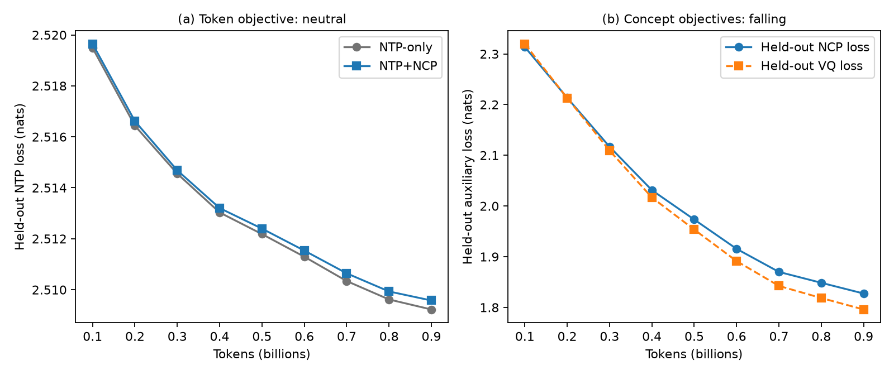
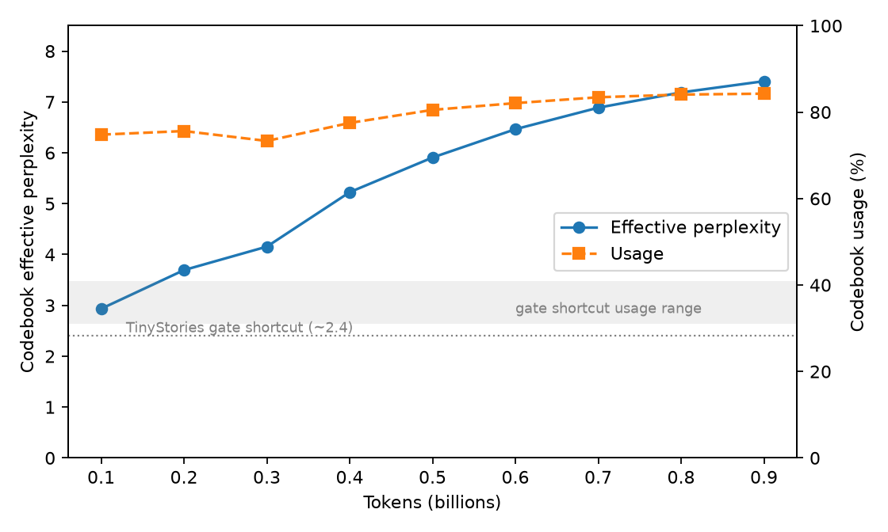

# Tessera-1B-Nano: Next Concept Prediction at 360M, replicated under a token-matched control

**Paragon Intelligence Labs.** Whitepaper, September 2026.

Naming: Tessera-1B-Nano is our name for the checkpoint this study produces. Tessera, the
mosaic tile, reflects the design: token states are pooled into small tiles, quantized, and
reassembled into a latent picture the decoder reads alongside the tokens. The 1B refers to
the matched token budget, Nano to the 360M-class scale. The training code and the internal
package keep the project id `ncp-smol`.

Every number in this document is copied from committed artifacts: `results/fineweb-edu-ntp/`,
`results/fineweb-edu-ncp/`, and `results/fineweb-edu/`. No result below comes from a partial
run.

## Abstract

Next Concept Prediction (NCP) augments a causal language model with a latent path: token
states are pooled into concepts, product-quantized, processed by causal concept layers, and
the predicted next concept is fed back into the token decoder. We present an independent,
small-scale replication of the ConceptLM recipe on SmolLM2-360M and a token-matched
comparison against the unchanged backbone on FineWeb-Edu: both arms consume exactly
999,948,288 tokens in the same order, from the same initialization, with no restarts and
no NaNs, for a combined tracked compute of $55.12. The headline token result is neutral:
held-out NTP loss 2.5135 (NTP-only) versus 2.5142 (Tessera-1B-Nano), a +0.03% difference
within run noise. The concept path itself is emphatically not neutral. Zeroing predicted
concept feedback costs +0.1050 nats (+4.2% perplexity) at inference: the decoder
demonstrably consumes the channel. The learned codebook is rich and non-collapsed:
effective perplexity 7.55 with 85.6% usage, grown monotonically from 2.93/74.8% at 100M
tokens. Yet shuffling concept feedback across sequences in the batch costs only +0.0008:
the decoder's use of the channel is sequence-generic, not sequence-specific, a split we
already observed at the 135M TinyStories gate and replicate here at 360M on 1B tokens. The
neutral token loss mirrors the original paper's own ablation structure, where `L_ntp`
paired with either auxiliary loss alone underperforms pure NTP and only the full triple
wins, at 8 to 300B-token training scales. We release training code, causal leakage tests,
matched data caches with hashes, full metric logs, and the next probes we would run,
stated in advance.

## 1. Why a small matched replication

ConceptLM (arXiv 2602.08984) reports that adding the concept objective to next-token
prediction improves downstream accuracy at scales from 410M/300B tokens to 8B continual
pretraining. Independent verification of such claims usually waits for large compute. We
ask the cheapest controlled question instead: does the objective produce a useful signal
when continued pretraining is reduced to a 360M backbone and roughly one billion tokens?
A neutral answer at this scale is informative precisely because the design isolates the
mechanism, not just the headline.

The project was built around falsification. Before the matched run, two architecture gates
had to pass: (i) an overfit gate on TinyStories where NTP, NCP, and VQ losses must all fall
(they fell 41 to 43% over 16.8M tokens on SmolLM2-135M); (ii) a quantized-target pilot that
we aborted after 614k tokens when its NCP loss sat at ~1e-6, because transformed codewords
were too tightly clustered for selected-code prediction to define a meaningful error.
Reporting that pilot as "training works" would have been vacuous; aborting it defined the
prerequisite for any future quantized-target ablation: normalized or variance-matched
codewords.

## 2. What was implemented

The token backbone is `HuggingFaceTB/SmolLM2-360M` (revision `f8027fd0`), 361.8M
parameters, kept intact for ordinary next-token generation. The concept path adds 20.8M
parameters:

- every `k = 4` token states are mean-pooled into a concept;
- each concept is product-quantized over 15 segments x 64 codewords;
- two causal Llama-style decoder blocks operate on the concept sequence (T/k = 256
  positions for sequence length 1024);
- the predicted next concept is added back to the token stream before token decoder
  block 2, aligned so that a prediction enters only at the boundary where its source chunk
  is fully in the past;
- training loss is `L_ntp + L_ncp + L_vq` with the continuous pooled state as the NCP
  regression target.

Causality is enforced and tested, not asserted: `tests/test_modeling.py` changes a
sequence suffix and asserts that all earlier logits stay unchanged. Ground-truth future
concepts are detached targets and never enter the decoder.

## 3. Matched design

Both arms read the same packed FineWeb-Edu cache, 1,000,000,000 train tokens and
10,000,000 held-out tokens, SHA256-pinned in `data_metadata.json`, in the same order, from
the same initialization, with identical optimizer settings (LR 3e-5, cosine to 10%, batch
8 x 16 accumulated at sequence length 1024, 131,072 tokens per step). The only training
difference is the concept path and its losses.

| | NTP-only | Tessera-1B-Nano (NTP+NCP) |
| --- | ---: | ---: |
| Tokens seen | 999,948,288 | 999,948,288 |
| Optimizer steps | 7,629 | 7,629 |
| Wall time | 9.08 h | 11.05 h |
| Tracked cost estimate | $24.85 | $30.27 |
| Throughput | 30,504 tok/s | 24,932 tok/s |
| Restarts / NaNs / config changes | 0 / 0 / 0 | 0 / 0 / 0 |

The concept path costs about 18% throughput. The cost figures are tracked allocation
estimates at $2.74/h (one A100-40GB, 8 cores, 32 GiB), not invoices; both runs finished
under their $60 software caps. The entire matched comparison, two arms, one billion tokens
each, cost about $55 of compute and ran uninterrupted from single containers.

Held-out evaluation runs every 100M tokens on fixed batches (32 blocks, batcher seed 37),
and the final intervention evaluation uses those exact batches, so every comparison below
is batch-identical, not merely dataset-identical.

## 4. Results

### 4.1 Token loss: neutral (H2)

Final held-out NTP loss is 2.5135 for NTP-only and 2.5142 for Tessera-1B-Nano
(perplexity 12.35 vs 12.36): +0.0007 nats, +0.03%, in favor of the pure token arm. The
gap is inside run noise at this scale. The two arms' mean train NTP losses track each
other within 0.0006 nats in every 763-step window across the entire run (mean |delta|
0.0004): adding a 20.8M-parameter latent path with two extra objectives did not perturb
the token trajectory it rides on.

### 4.2 The concept path trains cleanly (H1)

FineWeb-Edu train-loss means, first ten versus last ten windows: NTP 2.5438 -> 2.5136
(-1.2%), NCP 2.4505 -> 1.8220 (-25.6%), VQ 2.4572 -> 1.7890 (-27.2%). Unlike the aborted
quantized pilot, no auxiliary loss is degenerate; the concept objective learns.

*Figure 1. Held-out dynamics at the nine 100M-token checkpoints. (a) The NTP+NCP arm
tracks the NTP-only arm's token objective to within half a thousandth of a nat everywhere:
the neutral H2 is the two nearly identical curves. (b) At the same checkpoints the
auxiliary losses fall sharply and without collapse: the concept objectives learn.*

### 4.3 Interventions: the channel is used, rich, and generic (H3/H6)

At the final checkpoint, on identical held-out batches:

| Mode | Held-out NTP loss | Perplexity |
| --- | ---: | ---: |
| Predicted feedback | 2.5142 | 12.36 |
| Zero feedback | 2.6192 | 13.73 |
| Shuffled feedback | 2.5150 | 12.37 |

Three readings, in the order we consider them most important:

1. **The channel is used.** Zeroing predicted concept feedback costs +0.1050 nats (+4.2%
   perplexity). This is a causal statement about the trained model, not a correlation:
   the decoder's predictions measurably depend on the concept predictions it receives.
2. **The vocabulary is rich.** Codebook effective perplexity is 7.55 with 85.6% usage at
   the final checkpoint, grown monotonically from 2.93/74.8% at 100M tokens. The
   low-entropy shortcut that trapped the TinyStories gate (ppl ~2.4, usage 31 to 41%) did
   not recur at this scale.
3. **The use is sequence-generic.** Replacing each sequence's concept feedback with
   another sequence's feedback from the same batch, at the same chunk offsets, costs only
   +0.0008. The decoder consumes *something* from the concept channel, but almost nothing
   that identifies the specific sequence it is reading.
The same zero-hurts/shuffle-does-not split appeared at the 135M TinyStories gate. Two
scales, two data regimes, one replicated structure.

A cross-domain control sharpens the reading further. We captured predicted concept
feedback on out-of-distribution corpora (English Wikipedia, Python source code), then
swapped it in as the decoder's feedback on held-out FineWeb-Edu batches: +0.0016
(wikipedia) and +0.0011 (code), against +0.1050 for silencing the channel. Partner domain
does not matter at this effect size; the sequence-generic use holds across partner
identity, similarity, and domain.

*Figure 2. Codebook growth: effective perplexity 2.93 -> 7.41 and usage 74.8% -> 84.3%
across the nine held-out checkpoints (7.55 / 85.6% at the final intervention evaluation).
The dotted reference marks the low-entropy shortcut the TinyStories gate fell into
(~2.4 perplexity, 31 to 41% usage); at 1B tokens the codebook stays far above it and keeps
enriching throughout training.*

Boundary profile (H4): the zero-delta decays slightly across the chunk, +0.1066 at offset
0 to +0.1039 at offset 3, so the predicted concept helps most where it is freshest, as
expected, but the gradient of the effect is small and the offsets' absolute differences
are near noise.

### 4.4 Calibration against the original paper

The original ConceptLM ablation (their Table 4) reports held-out perplexity of 69.28 for
`L_ntp` alone, 76.30 for `L_ntp + L_ncp`, and 75.64 for `L_ntp + L_vq`: both auxiliary
pairs *alone are worse than pure NTP*. Only the full triple reaches 68.13. The reported
downstream gains come from the full triple at 300B (Pythia-410M), 8B (GPT-2 1.5B), and
9.6B (Llama-3.1-8B continual) tokens, totaling +0.4 average accuracy over the PM baseline.

Read against that, our neutral H2 is not a contradiction of the paper. It is the same
structure one scale lower and two orders of magnitude shorter: auxiliary losses fall
sharply, the token objective is unmoved, and the concept channel is demonstrably consumed.
Mechanistically, concept layers run on T/k positions, 256 per sequence here, a coarse,
sequence-level summary channel, which is consistent with the sequence-generic use the
shuffle control measures.

## 5. Discussion

The honest summary is a used-but-generic latent channel. The decoder pays +4.2% perplexity
when the channel is removed, so the feedback is load-bearing; the codebook is rich; yet
cross-sequence feedback is nearly as good as the sequence's own, so the payload the decoder
extracts is not sequence-identity information. Candidate explanations, in the order we
find most plausible: the channel carries topic/domain-level statistics that any local
window of FineWeb-Edu text shares; 256 concept positions per sequence is too coarse to
encode sequence-specific state; or the injection point (before decoder block 2) limits how
specific information can be exploited. None of these is decided by our data, which is why
the next probes are chosen to discriminate between them.

Limitations. One seed per arm; 1B tokens is far below the scales where the original paper
reports gains; the continuous-target variant sidesteps the paper's discrete selected-code
prediction (the quantized variant remains gated on codeword normalization); and the cost
figures are tracked estimates, not invoices. All eval differences should be read as
single-run comparisons at matched token counts, which is exactly what the design controls.

## 6. Next probes, stated in advance

Ordered by cost and discriminating power:

1. ~~**Similar-shuffle probe**~~ Executed: +0.0008, identical to random shuffle
   (`results/fineweb-edu-ncp/step-00007629-eval-similar.json`).
1b. ~~**Cross-domain feedback partner probe**~~ Executed: wikipedia partners +0.0016,
   code partners +0.0011 (`docs/probe-cross-domain.md`), ruling out domain gating.
2. ~~**Quantized-target ablation with normalized codewords**~~ Executed: with the
   variance-matching prerequisite satisfied, continuous and quantized targets land
   within +0.0002 NTP of each other at 16.8M tokens, and the quantized arm shows a
   slightly larger zero-feedback delta (`results/h5-quantized/README.md`).
3. **Sequence length 4096 at the same token budget**, testing whether concept-position
   granularity limits usefulness.
4. **4 to 8B tokens**, the same matched design, approaching the scales where the original
   paper's full-triple advantage appears.

## Reproducibility

The repository pins, per arm: training config, backbone revision, dataset revision, packed
token-cache SHA256 hashes, the complete metric log (`metrics.jsonl`, 772 records), final
trainer state (step, token cursor, wall time), `experiment.json`, and the raw intervention
evaluation JSON. The held-out batches are fixed by seed, so reported losses are
batch-exact. Model and dataset caches, the trainer, evaluator, and publisher are open
under Apache-2.0; the 21-test suite covers causality, data order, quantizer behavior,
progress reporting, and card building. The figures in this document regenerate from the
committed metric logs with `docs/figures/make_figures.py` (matplotlib is not a project
dependency; the script documents its ephemeral invocation).

## References

- Code, artifacts, and figures (this study): https://github.com/yava-code/Tessera-1B-Nano
- ConceptLM: Predicting Concepts, Not Just Tokens. https://arxiv.org/abs/2602.08984
- NCP-ArchPreview. https://arxiv.org/abs/2609.10715
- LUMIA-Group/ConceptLM. https://github.com/LUMIA-Group/ConceptLM
- SmolLM2. https://huggingface.co/HuggingFaceTB/SmolLM2-360M
- FineWeb-Edu. https://huggingface.co/datasets/HuggingFaceFW/fineweb-edu
